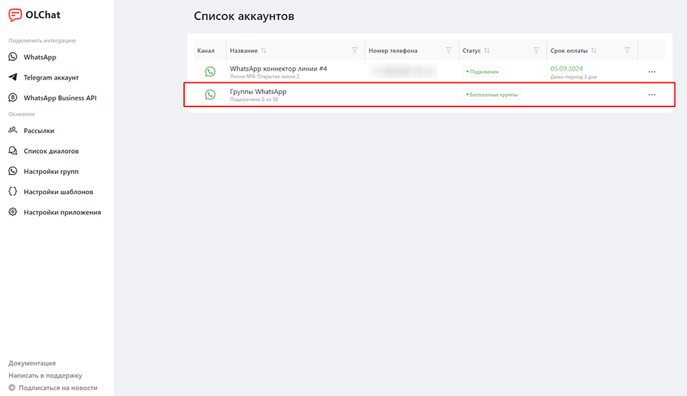

# Групповые чаты

Мы интегрировали групповые чаты WhatsApp в Битрикс24. Все групповые чаты отображаются в Чатах, а не в Открытых линиях.


Сейчас доступно 50 бесплатных групповых чатов. Групповые чаты работают только при активном коннекторе (аккаунте WhatsApp). Подключение свыше 50 групповых чатов [оплачивается отдельно](https://docs.olchat.io/stoimost-i-oplata-prilozheniya#stoimost-podklyucheniya-grupp-whatsapp).



В настоящее время поддерживается работа в группах до 500 участников. Работа с группами свыше 500 участников может быть не стабильной. Мы уже работаем над оптимизацией.



Внимание! Если вы недавно зарегистрировали номер в WhatsApp (создали аккаунт в WhatsApp) и подключили его к нашему сервису, в течение нескольких дней не создавайте группы с помощью сервиса! Если необходимо создать группу, сделайте это через приложение WhatsApp на телефоне, а потом подключите её к сервису.

Игнорирование данной рекомендации может привести к блокировке вашего аккаунта WhatsApp.


<figure><figcaption></figcaption></figure>

### Подключение групп

Чтобы подключить группы WhatsApp, в левом меню на портале зайдите в приложение Олча&#x442;**.** Затем перейдите в «Настройки групп» в меню приложения или в списке аккаунтов напротив «Группы WhatsApp» нажмите на **«•••»** – значок вызова настроек подключенных групп:

<figure><figcaption></figcaption></figure>

В открывшемся окне нажмите на иконку **Меню** — **«Подключить группу»**, выберите активный коннектор, затем группу, которую хотите подключить, и нажмите на кнопку «Подключить». Группа подключена, и вы можете перейти в создавшийся чат.

<figure><figcaption></figcaption></figure>

<figure><figcaption></figcaption></figure>

Также при подключении группы можно указать дополнительные настройки:

* Скрывать имена сотрудников. Активный чек-бокс указывает на то, что в группу не будут публиковаться имена сотрудников из их профиля на портале Битрикс24, когда они отправляют сообщения в группу
* Скрывать номера пользователей в группе. Настройка управляет возможностью скрывать\показывать номера клиентов в групповых чатах в Битрикс24. Если настройка включена, сотрудники портала, добавленные в групповой чат в Битрикс24 не будут видеть номер клиента целиком, т.к. часть номера будет заменена символами **\*.**\
  .png>)


Список групп для удобства отображения отсортирован в алфавитном порядке. Также доступен поиск по группам.


### Создание групп

Кроме подключения групп, в которых вы состоите, можно создавать новые группы и добавлять в них участников. Для этого нажмите на кнопку **Меню** — **«Новая группа WA».**

<figure><figcaption></figcaption></figure>

Внесите данные создаваемой группы:

<figure><figcaption></figcaption></figure>

1. Выберите аккаунт.
2. Введите название группы.
3. Укажите список телефонов участников группы.
4. Группу можно подключить в Битрикс24 сразу после её создания. Для этого необходимо сделать чек-бокс активным.

&#x20;После внесения информации нажмите на кнопку «Создать».

### Список групп

В столбцах списка содержится набор инструментов для управления подключенными группами:

<figure><figcaption></figcaption></figure>

Меню содержит в себе несколько столбцов:

1. **Название.** Присутствует строка для ввода названия и поиска коннекторов по названию. При клике на название группы открывается чат данной группы.
2. **Статус.** Настройка управляет возможностью фильтрации по статусам соединения коннекторов. Может принимать значения:
   * **Подключено** – группа подключена и готова к работе.
   * **Линия не подключена** – линия коннектора, от которой было выполнено подключение группы не активна.
3. **ID** – закодированное название подключенной группы. При клике на данную запись ID группы копируется в буфер обмена.
4. **Настройки «⚙»**. Позволяет перейти к настройкам конкретной группы.
5. **Выгрузка в Excel.** При нажатии на иконку  появляется возможность выгрузки списка групп в таблицу Excel. Для того, чтобы осуществить выгрузку, выберите параметры статуса: первый чек-бокс позволяет выбрать все группы, либо выберите необходимый статус, чтобы получить данные только по подключенным, либо только по отключенным группам. Далее необходимо нажать «Экспортировать в Excel», после чего начнется загрузка файла на ваше устройство.

<figure><figcaption></figcaption></figure>

В таблице Excel будут содержаться следующие данные: название, статус, ID (идентификатор) группы. В ячейках, содержащих ID группы, будет указан как ID, так и номер линии, к которой относится подключённая группа.

<figure><figcaption></figcaption></figure>


В столбцах меню Название и Статус доступна возможность фильтрации списка групп по соответствующим параметрам.


### Описание настроек групп

Чтобы перейти в настройки конкретной группы, нажмите на шестерню ⚙ напротив группы. Откроется меню с дополнительными настройками для данной группы.

<figure><figcaption></figcaption></figure>

<figure><figcaption></figcaption></figure>

1. Статус — показывает текущий статус соединения и коннектор, от которого подключена группа.
2. ID группы — закодированное название подключенной группы. При клике на данную запись – ID группы копируется в буфер.
3. Аватар группы. Отображается картинка, установленная в качестве аватара в группе. При необходимости можно сменить, нажав на иконку 📷.
4. Название группы. Можно изменить и сохранить изменения, нажав на кнопку «Сохранить».
5. Номера пользователей. Отображает список номеров пользователей, состоящих в группе в данный момент. Для добавления введите номер в международном формате и нажмите Enter. Чтобы удалить пользователя из группы, нажмите на значок «✖» крестик напротив номера телефона пользователя.
6. Скрывать имена сотрудников. Активная галочка указывает на то, что в группу не будут публиковаться имена сотрудников из их профиля на портале Битрикс24 когда они отправляют сообщения в группу.
7. Скрывать номера пользователей в группе. Настройка управляет возможностью скрывать\показывать номера клиентов в групповых чатах в Битрикс24. Если данная настройка включена, сотрудники портала, добавленные в групповой чат в Битрикс24 не будут видеть номер клиента целиком, т.к. часть номера будет заменена символами **\*.**
8. Пытаться получать имена из CRM. В группе WhatsApp не всегда есть контакты и имена. При включении этой опции производится попытка получить имена из базы CRM.
9.  Связь с CRM. К сущности CRM можно прикрепить ссылку на групповой чат. Она появится в виджете [vidzhet-statusy-i-chaty.md](../ispolzovanie/vidzhety-v-kartochke-crm/vidzhet-statusy-i-chaty.md "mention") в карточке CRM. 

    <figure><figcaption></figcaption></figure>
10. Сотрудники в чате — выводит список сотрудников портала, присутствующих в чате группы. Чтобы добавить сотрудников в чат группы, необходимо нажать на кнопку «ДОБАВИТЬ СОТРУДНИКОВ» и выбрать его из структуры компании. Чтобы удалить сотрудника из чата, нажмите на значок «✖» крестик напротив ФИО сотрудника.
11. Кнопка «Отключить» – отключает данную группу от портала Битрикс24.


В разделе настроек групп «Номера пользователей» доступно редактирование введённых номеров. Для редактирования дважды нажмите на номер, внесите необходимые изменения и нажмите «», чтобы применить их. Для отмены редактирования нажмите «».


<figure><figcaption></figcaption></figure>


Перед добавлением в группу пользователей по номеру телефона, рекомендуем ознакомиться со статьёй [osobennosti-dobavleniya-polzovatelei-v-gruppy.md](osobennosti-dobavleniya-polzovatelei-v-gruppy.md "mention").


### Отключение нескольких групп

Для отключения сразу нескольких групповых чатов WhatsApp от Битрикс24:



Перейдите в «Настройки групп» из основного меню приложения OLChat.

<figure><figcaption></figcaption></figure>



Отметьте желаемые для отключения группы, либо нажмите «Выбрать все».

<figure><figcaption></figcaption></figure>



Нажмите кнопку «Отключить выбранные».


