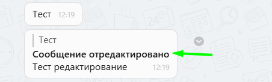
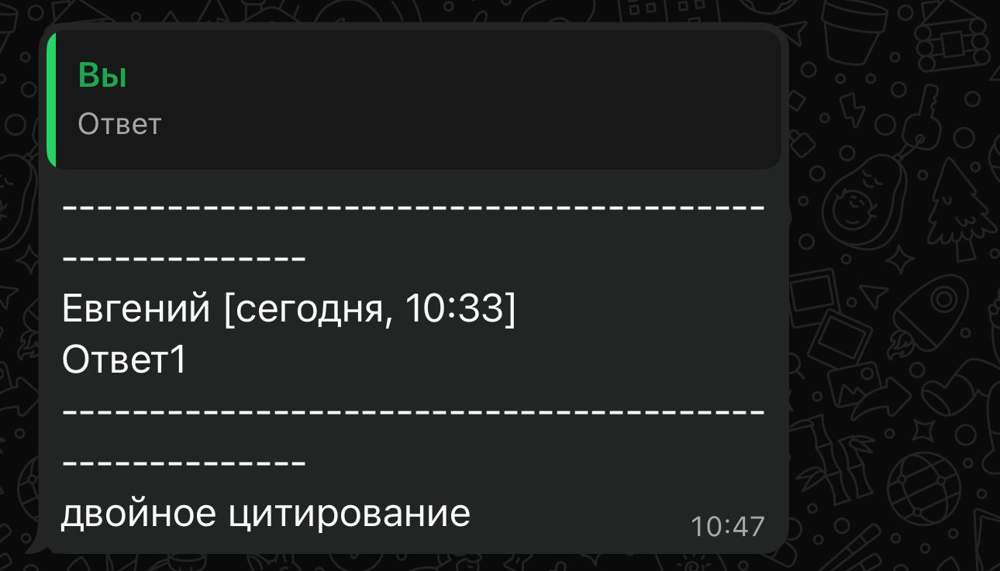

# Получение и отправка сообщений

Общение с клиентом происходит через стандартный функционал открытых линий Битрикс24.


Открытые линии Битрикс24:\
[https://www.bitrix24.ru/features/olines.php](https://www.bitrix24.ru/features/olines.php)

Открытые линии: общие настройки\
[https://helpdesk.bitrix24.ru/open/2448369/](https://helpdesk.bitrix24.ru/open/2448369/)



В функционале Открытых линий сотруднику видно только те чаты, в которых он состоит.\
Все диалоги можно посмотреть в списке диалогов.


Когда клиент пишет вам в WhatsApp, создаётся чат, в котором и ведётся дальнейшее общение.

Вы можете использовать все возможности открытых линий, такие как приветственное сообщение, очередь операторов, оценка качества и другие.

Чтобы продолжить общение с клиентом, достаточно нажать на иконку чата в карточке контакта, клиента или сделки, либо на кнопку «ОТКРЫТЬ».

<figure><figcaption></figcaption></figure>

<figure><figcaption></figcaption></figure>


В чатах открытых линий работают статусы сообщений:

* Одна серая галочка – сообщение отправлено но не доставлено.
* Две серые галочки – сообщение доставлено но не прочитано.
* Две синие галочки – сообщение прочитано.


.png>)


Если сообщение было удалено в чате открытой линии, оно также удалится в чате WhatsApp.


.png>) .png>)


Если вы не видите отчёты о прочтении (две синие галочки):

* Возможно, вы или получатель отключили отчёты о прочтении в своих [настройках конфиденциальности](https://faq.whatsapp.com/general/security-and-privacy/how-to-change-your-privacy-settings).
* Получатель мог вас заблокировать.
* Телефон получателя может быть выключен.
* Возможно, получатель ещё не открыл чат с вами.
* Возможно, у вас или у получателя возникли проблемы с подключением.


Для включения/отключения отчётов о прочтении необходимо зайти в WhatsApp → «Параметры» → «Настройки» → «Аккаунт» → «Конфиденциальность»**.** Выберите «Отчёты о прочтении»**.** Нажмите «ОТКЛЮЧИТЬ», если не хотите чтобы галочки окрашивались в синий цвет, или «ВКЛЮЧИТЬ», если хотите видеть отчёты о прочтении. Подробнее вы можете ознакомиться в статье справочного центра WhatsApp [Отчёты о прочтении](https://faq.whatsapp.com/kaios/security-and-privacy/how-to-check-read-receipts/?lang=ru).

### Получение отредактированных сообщений

Отредактированные сообщения в WhatsApp отображаются прямо в Открытых линиях Битрикс24.

Если клиент или вы редактируете сообщение в WhatsApp, в Битрикс24 автоматически придёт новое сообщение с пометкой об изменении.

<figure><figcaption></figcaption></figure>

### Расшифровка голосовых сообщений

Для входящих голосовых сообщений длительностью до 5 минут добавлена функция автоматической текстовой расшифровки (транскрибации) сообщения. Текст сообщения отображается в чате открытой линии рядом с голосовым сообщением. Сам процесс расшифровки занимает 5-20 секунд.

В последнем сообщении текста расшифровки содержится краткое Al-определение (определение, созданное искусственным интеллектом) сути вопроса (1), либо совет от Al с примерным текстом ответа на заданный вопрос (2).

<figure><figcaption></figcaption></figure>

### Цитирование сообщений

При цитировании сообщений оператором открытой линии клиент имеет удобную возможность перейти на цитируемое сообщение, кликнув по нему.


Переход по цитируемому сообщению доступен для клиента на любом устройстве/платформе WhatsApp.


Чтобы выполнить цитирование сообщения, нажмите кнопку контекстного меню  рядом с необходимым сообщением, далее выберите «Цитировать сообщение». Цитируемое сообщение появится в поле ввода ответа. Напишите необходимый ответ ниже.

<figure><figcaption></figcaption></figure>

<figure><figcaption></figcaption></figure>

Цитирование также можно выполнить, зажав на клавиатуре клавишу CTRL (Control), далее нажмите кнопку контекстного меню  рядом с необходимым сообщением. Цитируемое сообщение появится в поле ввода ответа. Напишите необходимый ответ ниже.


Функционал открытых линий позволяет цитировать сразу несколько сообщений в одном ответе, однако WhatsApp процитирует лишь первое из них. Остальные цитаты будут отображаться некорректно из-за ограничений WhatsApp. Настоятельно рекомендуем применять цитирование только к одному сообщению в ответе.


Несмотря на корректный вид отображения двойного цитирования в открытых линиях, клиент увидит некорректно отображенное сообщение.

<figure><figcaption></figcaption></figure> <figure><figcaption></figcaption></figure>

### Отображение источника сообщения

В открытых линиях сообщения, отправляемые операторами в чат с клиентом, имеют префиксы, обозначающие способ отправки каждого конкретного сообщения.

<figure><figcaption></figcaption></figure>

* **Сообщение из приложения в карточке.** Как отправлять сообщения из карточки сущности, написано [здесь](kak-napisat-pervym-cherez-prilozhenie-olchat-v-kartochke.md).
* **Сообщение, написанное с телефона.** Такие сообщения отправляются через стандартное приложение WhatsApp с мобильного устройства. Для того чтобы работал данный способ отправки сообщений, подключенный номер к открытой линии и номер, авторизованный в приложении WhatsApp на мобильном устройстве, должны совпадать.
* **Сообщение, отправленное через функционал СМС.** Как отправлять сообщения через функционал СМС, написано [здесь](kak-napisat-pervym-sms.md).
* **Сообщение из чата открытой линии.** Стандартное сообщение, отправленное оператором из чата открытой линии с клиентом.


Сообщения с префиксом «С телефона» могут быть отправлены не только с помощью мобильного приложения WhatsApp. Данный префикс также отображается в случаях, когда сообщение написано из веб-версии WhatsApp, а также приложения WhatsApp на ПК.


