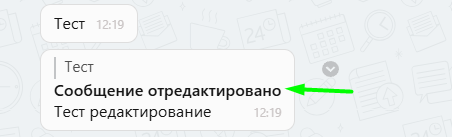

# Получение и отправка сообщений

Общение с клиентом происходит через стандартный функционал открытых линий Битрикс24


Открытые линии Битрикс24\
[https://www.bitrix24.ru/features/olines.php](https://www.bitrix24.ru/features/olines.php)



В функционале Открытых линий сотруднику видно только те Чаты, в которых он состоит.\
Все диалоги можно посмотреть в Списке диалогов.


Когда клиент пишет вам в WhatsApp создаётся чат в котором и ведётся дальнейшее общение.

Вы можете использовать все возможности открытых линий, такие как приветственное сообщение, очередь операторов, оценка качества и другие.


Открытые линии: общие настройки\
[https://helpdesk.bitrix24.ru/open/2448369/](https://helpdesk.bitrix24.ru/open/2448369/)


Чтобы продолжить общение с клиентом достаточно нажать на иконку чата в карточке контакта, лида или сделки или на кнопку «ОТКРЫТЬ».

<figure><figcaption></figcaption></figure>

<figure><figcaption></figcaption></figure>


В чатах открытых линий мы добавили статусы сообщений:

* Одна серая галочка – сообщение отправлено но не доставлено
* Две серые галочки – сообщение доставлено но не прочитано
* Две синие галочки – сообщение прочитано


.png>)


Если сообщение было удалено в чате открытой линии, оно также удалится в чате WhatsApp


.png>).png>)


Если вы не видите отчёты о прочтении – две синие галочки:

* Возможно, вы или получатель отключили отчёты о прочтении в своих [настройках конфиденциальности](https://faq.whatsapp.com/general/security-and-privacy/how-to-change-your-privacy-settings)
* Получатель мог вас заблокировать
* Телефон получателя может быть выключен
* Возможно, получатель ещё не открыл чат с вами
* Возможно, у вас или у получателя возникли проблемы с подключением


Для включения/отключения отчётов о прочтении необходимо зайти в WhatsApp > **Параметры** > **Настройки** > **Аккаунт** > **Конфиденциальность.** Выберите **Отчёты о прочтении.** Нажмите **ОТКЛЮЧИТЬ,** если не хотите чтобы галочки окрашивались в синий цвет, или **ВКЛЮЧИТЬ,** если хотите видеть отчёты о прочтении. Подробнее вы можете ознакомиться в статье справочного центра WhatsApp [Отчёты о прочтении](https://faq.whatsapp.com/kaios/security-and-privacy/how-to-check-read-receipts/?lang=ru).

### Получение отредактированных сообщений&#x20;

Отредактированные сообщения в WhatsApp отображаются прямо в Открытых линиях Битрикс24.&#x20;

Если клиент или вы редактируете сообщение в WhatsApp, в Битрикс24 автоматически придёт новое сообщение с пометкой об изменении.

<figure><figcaption></figcaption></figure>

Если клиент или вы редактируете сообщение в WhatsApp, в Битрикс24 автоматически придёт новое сообщение с пометкой об изменении.

### Расшифровка голосовых сообщений


Для входящих голосовых сообщений длительностью до 5 минут добавлена функция автоматической текстовой расшифровки (транскрибации) сообщения! Текст сообщения отображается в чате открытой линии рядом с голосовым сообщением. Сам процесс расшифровки занимает 5-20 секунд.


<figure><figcaption></figcaption></figure>
