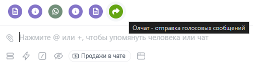
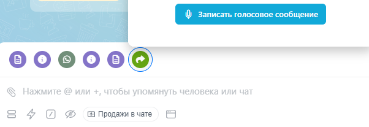

# Отправка голосовых сообщений из Открытой линии

В Олчат WhatsApp можно записывать и отправлять голосовые сообщения клиенту прямо из чата Открытой линии Битрикс24. Переходить в WhatsApp для записи сообщения не требуется.

### Как отправить голосовое сообщение

1. Откройте нужный чат WhatsApp в Открытой линии.
2.  В поле отправки сообщения нажмите на значок **Олчат - отправка голосовых сообщений**.

    <figure><figcaption></figcaption></figure>
3.  Нажмите **Записать голосовое сообщение**. 

    <figure><figcaption></figcaption></figure>
4.  После нажатия начнётся запись голосового сообщения. Во время записи отображается её длительность. 

    <figure><figcaption></figcaption></figure>
5.  Когда закончите запись, нажмите **Готово**.

    Если запись нужно отменить, нажмите на значок **корзины**. 

    <figure><figcaption></figcaption></figure>
6. Нажмите **Отправить**.

Голосовое сообщение будет отправлено клиенту в WhatsApp.
