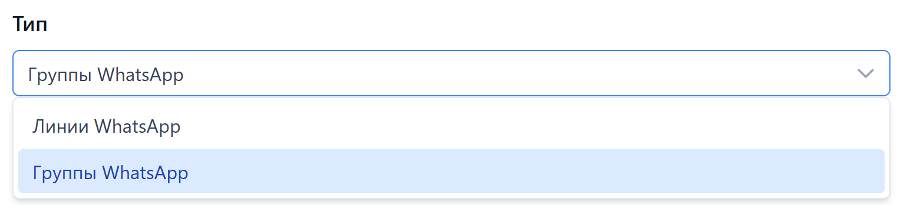

# New Оплата групп

Для оплаты коннектора или групп приложения OLChat выполните следующие действия:



#### Перейдите в приложение OLChat и выберите пункт "Новый платёж" из раздела "Оплаты и счета".

<figure><figcaption></figcaption></figure>



#### В поле "Компания" нажмите "", затем "+ Добавить компанию".

<figure><figcaption></figcaption></figure>


При повторной оплате воспользуйтесь поиском для автоматической подстановки данных компании.



В случае, если данные компании изменились, выберите "Редактировать", чтобы внести актуальные данные.

В случае, если необходимо полностью удалить данные о компании, воспользуйтесь кнопкой "Удалить".




#### Укажите страну, в которой юридически зарегистрирована компания, далее укажите название компании и контактные данные ответственного за оплаты.

Для автоматической подстановки данных введите название компании или ИНН в поле "Название компании".

<figure><figcaption></figcaption></figure>


Все поля являются обязательными к заполнению.



Обязательно проверьте правильность выбранных данных для избежания ошибок в оплате.




#### Выберите тип оплаты: Группы WhatsApp.

<figure><figcaption></figcaption></figure>


На данный момент нельзя провести оплату линий и групп в одном платеже. Наша команда уже работает над такой возможностью.




#### Выберите желаемый тариф и период оплаты.

Доступны тарифы на 50 групп, 150 групп и безлимитное количество групп.


Тариф на 50 групп является бесплатным и необходим к оплате за 0 рублей в случае, если решите отказаться от использования тарифов на 150 и неограниченное количество групп.


Доступна оплата на 30, 90, 180 и 360 дней.

<figure><figcaption></figcaption></figure>



#### Проверьте выбранный заказ в Корзине и нажмите "Перейти к оплате".

<figure><figcaption></figcaption></figure>



#### Выберите способ оплаты: оплата картой или по счёту.

В случае оплаты банковской картой онлайн, нажмите "Оплатить" и завершите оплату с помощью сервиса.

В случае оплаты по счёту, выберите соответствующий пункт, а затем скачайте счёт и завершите оплату.

<figure><figcaption></figcaption></figure>



#### Оплата групп WhatsApp в приложении OLChat завершена.

Чтобы просмотреть историю платежей, а также узнать статус заказов (оплат), на главной странице приложения OLChat выберите "Все оплаты и счета" раздела "Оплаты и счета".

<figure><figcaption></figcaption></figure>


