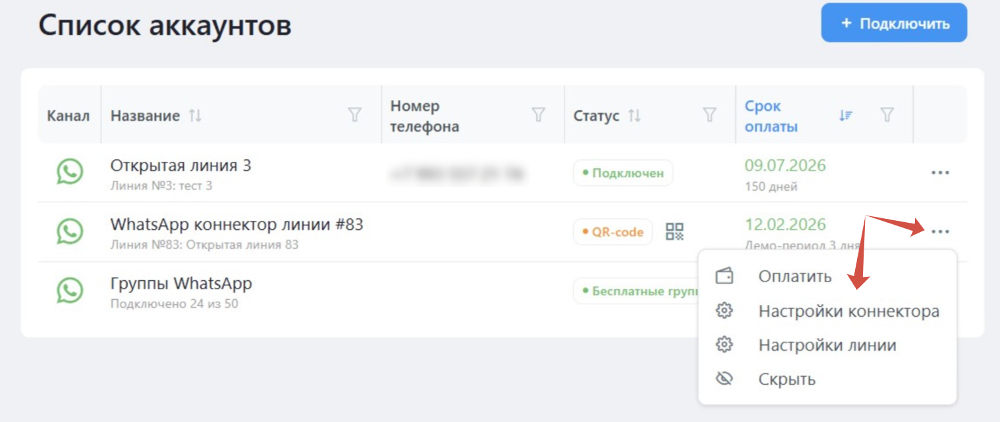
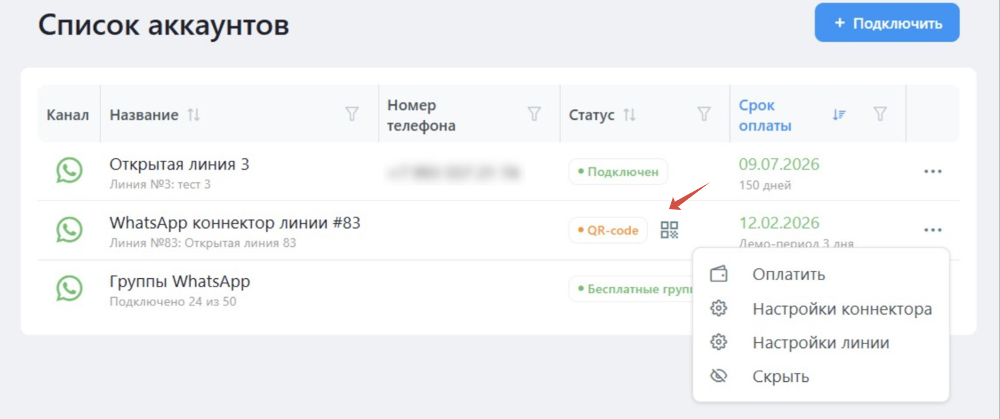

# Добавление дополнительных аккаунтов WhatsApp

OLChat позволяет подключить несколько аккаунтов WhatsApp на портал Битрикс24, и создать для каждого из них отдельную Открытую линию. С помощью [настроек Открытых линий](../nastroika-otkrytoi-linii.md) можно указать тех сотрудников, которые будут иметь доступ к использованию конкретного номера, и настроить индивидуальные сценарии работы для каждого подключенного коннектора.


Каждый подключенный коннектор (аккаунт WhatsApp) оплачивается отдельно. Подробнее о тарифах OLChat  можно узнать из статьи [stoimost-i-oplata-prilozheniya](../../stoimost-i-oplata-prilozheniya/ "mention").



Внимание! В случае, когда номер телефона, используемый в OLChat, был недавно зарегистрирован в WhatsApp, в течение нескольких дней не создавайте группы с помощью сервиса! Если необходимо создать группу – сделайте это через приложение WhatsApp на телефоне, а потом [подключите её к сервису](../../gruppovye-chaty/gruppy.md#podklyuchenie-grupp).

Игнорирование данной рекомендации может привести к блокировке вашего аккаунта WhatsApp.


Чтобы подключить новый аккаунт WhatsApp, перейдите в приложение OLChat (в меню портала Битрикс24 слева) и выберите пункт «WhatsApp».

<figure><figcaption></figcaption></figure>


Если у вас несколько открытых линий, из выпадающего списка выберите Открытую линию к которой собираетесь подключить коннектор, нажав на кнопку «Подключить». Если линий для подключения нет, вы можете создать новую, нажав на ссылку «Создать новую линию»


<figure><figcaption></figcaption></figure>

### Подключение коннектора

После подключения открытой линии можно перейти к подключению коннектора. Для этого напротив подключаемого коннектора нажмите на значок меню «•••» и выберите пункт «Настройки коннектора».

<figure><figcaption></figcaption></figure>

Также к сканированию QR-кода можно перейти из списка аккаунтов, не заходя в «Настройки коннектора», нажав на иконку «Отсканировать QR-код» напротив подключаемого коннектора:

<figure><figcaption></figcaption></figure>

В открывшемся окне нажмите на кнопку «Загрузить QR-код» и следуйте инструкции на экране:

<figure><figcaption></figcaption></figure>


Подробнее о подключении коннектора и предварительных настройках телефона можно узнать из статьи [podklyuchenie-konnektora.md](../podklyuchenie-konnektora.md "mention").

Информацию по настройке Открытой линии вы можете найти в статье [nastroika-otkrytoi-linii.md](../nastroika-otkrytoi-linii.md "mention").

