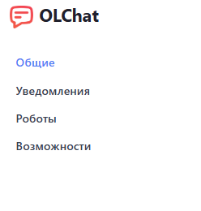
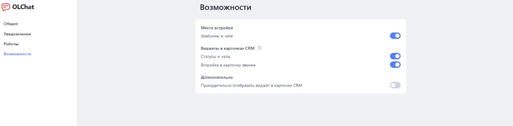

# Описание настроек приложения

Для перехода к настройкам коннектора, в левом меню портала выберите приложение «OLChat»:

<figure><figcaption></figcaption></figure>

В открывшемся окне приложения выберите пункт меню «Настройки приложения»:

<figure><figcaption></figcaption></figure>

Страница «Настройки приложения» содержит несколько вкладок с настройками:

<figure><figcaption></figcaption></figure>

### Общие

<figure><figcaption></figcaption></figure>

В разделе «ОСНОВНЫЕ» содержатся следующие настройки:

1. Возможность ограничить доступ к странице приложения. Подробнее в статье [#pravo-na-prosmotr-stranicy-prilozheniya](../nastroika-prav-dlya-raboty-s-prilozheniem-olchat.md#pravo-na-prosmotr-stranicy-prilozheniya "mention")
2. Информация о том, под правами какого пользователя работает приложение и возможность их сменить. Подробнее в статье [#ustanovka-prav-administratora-na-prilozhenie](../nastroika-prav-dlya-raboty-s-prilozheniem-olchat.md#ustanovka-prav-administratora-na-prilozhenie "mention")
3. Параметры времени для звонков/сообщений. Настройка устанавливает временной диапазон для индикатора часового пояса. Указано время со скольки до скольки можно, не желательно, нельзя писать и звонить:
   * Зелёный – Можно звонить, писать
   * Оранжевый – Не желательно звонить, писать
   * Красный – Нельзя звонить, писать&#x20;

### Уведомления

<figure><figcaption></figcaption></figure>

В данном разделе содержится ссылка на переход в чат уведомлений и возможность добавить в этот чат сотрудников. Подробнее в статье [tipy-uvedomlenii-prilozheniya.md](tipy-uvedomlenii-prilozheniya.md "mention")

### Роботы

<figure><figcaption></figcaption></figure>

Раздел «РОБОТЫ» содержит список всех роботов и активити бизнес-процессов приложения OLChat и кнопку для их обновления. Подробнее в статье [roboty](../../roboty-i-aktiviti/roboty/ "mention")

### Возможности

<figure><figcaption></figcaption></figure>


В Настройках приложения вкладка "Возможности" доступна только пользователям, имеющим роль "Администратор". В случае отсутствия у пользователя соответствующих прав доступа, вкладка будет недоступна.


В разделе «ВОЗМОЖНОСТИ» можно произвести включение/выключение отображения шаблонов в чате и виджетов «Статусы и чаты» и «Встройка в карточку звонка».

Подробнее о виджетах в статье [vidzhety-v-kartochke-crm](../../ispolzovanie/vidzhety-v-kartochke-crm/ "mention")

1. Подробнее о встройке «Шаблоны в чате» в статье [#otpravka-shablonnogo-soobsheniya-iz-chata-otkrytoi-linii](../../capabilities/shablony-soobshenii.md#otpravka-shablonnogo-soobsheniya-iz-chata-otkrytoi-linii "mention")
2. Подробнее о виджете «Статусы и чаты» в статье [vidzhet-statusy-i-chaty.md](../../ispolzovanie/vidzhety-v-kartochke-crm/vidzhet-statusy-i-chaty.md "mention")
3. Подробнее о виджете «Встройка в карточку звонка» в статье [vstroika-v-kartochku-zvonka.md](../../ispolzovanie/vidzhety-v-kartochke-crm/vstroika-v-kartochku-zvonka.md "mention")
4. Принудительно отображать виджет в карточке CRM. По умолчанию виджет «Статусы и чаты» при заходе в карточку сущности отображаются в скрытом виде с кнопкой «Написать в WhatsApp»:

<figure><figcaption></figcaption></figure>

Сделано это для снижения рисков блокировки номера, т.к. при каждом заходе в карточку, виджетом производится проверка номеров указанных в карточке на наличие аккаунта WhatsApp. При этом, если вы не производите отправку сообщений посредством приложения, возрастает соотношение количества проверок номеров к количеству отправок, что может повлечь за собой блокировку вашего аккаунта WhatsApp.


Мы крайне не рекомендуем активировать данную настройку!  Если вы всё же её включаете — помните, что вы делаете это на свой страх и риск!

