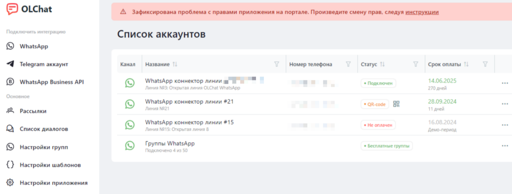

# Настройка прав

Настройка прав для работы с приложением OLChat осуществляется в нескольких местах на портале. Для корректной работы c приложением необходимо выдать права на само приложение, на просмотр страницы приложения, на настройку открытой линии, на карточку CRM и на коннектор линии тем сотрудникам, чья работа предполагает использование и настройку приложения OLChat.

### Права на коннектор линии

Изначально возможность выбора коннектора для отправки сообщений доступна всем сотрудникам, у кого есть права на использование приложения. Однако вы можете разграничить доступ к коннекторам и для определённых сотрудников или отделов выделить именно тот коннектор, который они должны использовать в работе.

Чтобы выдать права на использование коннектора сотруднику или отделу, перейдите в приложение **OLChat —** ••• **— Настройки коннектора — Доступ к коннектору — +добавить.**

<figure><figcaption></figcaption></figure>

Выберите из структуры компании нужный отдел или пользователя. Нажмите кнопку «ВЫБРАТЬ».&#x20;

<figure><figcaption></figcaption></figure>


Поддерживаемые типы прав для настройки доступа к коннектору линии — «Пользователи», «Сотрудники и отделы» и «Группы социальной сети». Тип прав «Другое» не поддерживается.

Также не поддерживается выбор из структуры «Все сотрудники отдела с подотделами».


Если вы хотите открыть доступ к коннектору для всех сотрудников, необходимо нажать на «Изменить» и не выбирая никого нажать на кнопку «ВЫБРАТЬ». Система очистит список прав и данный коннектор станет доступен для всех.

### Права на приложение

Для настройки прав на приложение, зайдите в **Маркет — Ещё — Установленные приложения —  OLChat — Доступ** и добавьте всех, кто может пользоваться приложением.

Если вы не добавите никого – приложение будет доступно всем сотрудникам на портале.

<figure><figcaption></figcaption></figure>

### Права на открытые линии

Чтобы выдать права на настройку открытой линии, перейдите в **CRM — Клиенты — Контакт центр — карточка \[OLChat] WhatsApp — Права доступа — Настроить.** В списке ролей добавьте новую роль или отредактируйте набор прав для представленных ролей. Чтобы сотрудник мог управлять настройками открытой линии, выдайте права на изменение в сущностях **Список открытых линий** и **Общие настройки**. Сохраните изменения. Затем присвойте роль нужному сотруднику или отделу, выбрав её из выпадающего списка ролей. Нажмите на кнопку «СОХРАНИТЬ».

При необходимости можно удалить имеющиеся настройки прав и добавить новые. Чтобы добавить новые права, нажмите на ссылку **Добавить право доступа,** выберите из структуры компании нужный отдел или сотрудника и присвойте ему необходимую роль. Нажмите на кнопку «СОХРАНИТЬ».

<figure><figcaption></figcaption></figure>

Если вы хотите, чтобы сотрудники видели только свои переписки, настройте для этих сотрудников права таким образом, как показано на скриншоте ниже:

<figure><figcaption></figcaption></figure>

Также вы можете немного расширить права сотрудников и выдать им доступ на просмотр истории разговоров, установив в пункте «История разговора» значение «Любые». При этом сотрудники также не смогут подключаться и писать в чат, который за ними не закреплён, если остальные настройки установлены так как показано на скриншоте ниже:

<figure><figcaption></figcaption></figure>

Доступ к истории разговора зависит от прав пользователя в CRM, и права CRM важнее прав в открытых линиях. Если у сотрудника есть доступ к сделке, он сможет открыть и прочитать диалог из карточки CRM. Например, руководитель сможет ознакомиться с историей чата и проверить, как сотрудник работает со сделкой.

Возможность подключения к разговору также зависит от прав пользователя в CRM. Если у сотрудника есть доступ к лиду или сделке, он сможет подключиться к диалогу. Например, ответственный менеджер в отпуске, а клиент задал в чате вопрос по заказу. Коллега сотрудника с доступом к карточке CRM сможет в любой момент прочитать диалог и продолжить общение с клиентом.

<figure><figcaption></figcaption></figure>


Подробнее с настройками прав для открытой линии вы можете ознакомиться в статье от Битрикс24 [Права доступа на Открытые линии](https://helpdesk.bitrix24.ru/open/5391975/) . Обратите внимание, что «Статистика разговоров» отвечает за то, какие чаты сотрудники смогут видеть в Списке диалогов.


### Права на карточку CRM

Чтобы сотрудник имел возможность пользоваться приложением из карточки лида или сделки, необходимо настроить права на карточку CRM. Для этого перейдите в **CRM — Настройки — Права — Права доступа.** В списке ролей добавьте новую роль или отредактируйте набор прав для представленных ролей. Для использования приложения сотруднику необходимо установить права на **Изменение** лида или сделки. Сохраните изменения. Затем присвойте роль нужному сотруднику или отделу, выбрав её из выпадающего списка ролей. Нажмите на кнопку «Сохранить».

<figure><figcaption></figcaption></figure>

При необходимости можно удалить имеющиеся настройки прав и добавить новые. Чтобы добавить новые права, нажмите на ссылку **Добавить право доступа,** выберите из структуры компании нужный отдел или сотрудника и присвойте ему необходимую роль. Нажмите на кнопку «Сохранить».

### Право на просмотр страницы приложения

Право на просмотр страницы приложения и управления настройками можно выдать только администраторам либо всем сотрудникам портала. Для управления этой настройкой перейдите в приложение **OLChat — Настройки — Основные.** Активируйте галочку «Показывать страницу приложения только администраторам», если необходимо дать доступ на просмотр страницы приложения только администраторам портала.

<figure><figcaption></figcaption></figure>

### Установка прав администратора на приложение


Иногда возникает ситуация, когда сотрудника, установившего приложение OLChat, необходимо уволить с портала Битрикс24. Если это сделать без передачи главных прав на управление приложением, оно перестанет работать.


Если на портале есть проблема с установкой прав администратора на приложение, то на главной странице будет отображаться следующее:

<figure><figcaption></figcaption></figure>

Чтобы приложение работало корректно, необходимо проверить под чьими правами работает приложение.&#x20;


Сменить права можно только на того пользователя, который является администратором портала


Изменить пользователя, под чьими правами должно работать приложение можно зайдя в приложение **OLChat — Настройки — Основные.** Вы увидите пользователя, под чьими правами приложение работает в данный момент. Чтобы сменить права нажмите на кнопку «СМЕНИТЬ ПРАВА НА ТЕКУЩЕГО ПОЛЬЗОВАТЕЛЯ».

<figure><figcaption></figcaption></figure>


Если не работает смена прав пользователя, то необходимо переустановить приложение. Для этого удалите приложение OLChat и установите его заново [по инструкции.](ustanovka-prilozheniya.md)

