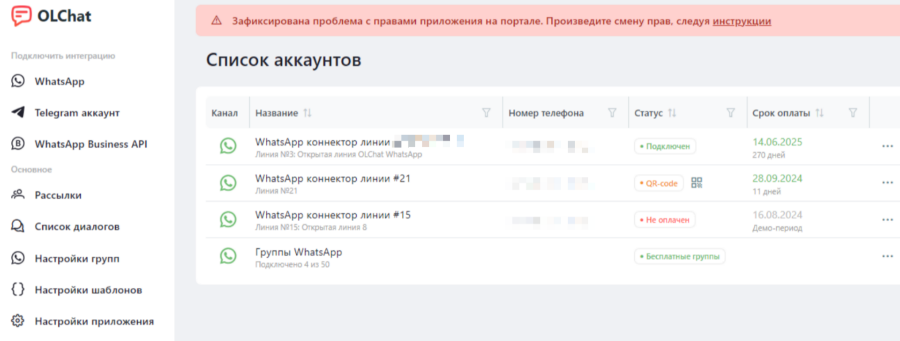

# Настройка прав

Настройка прав для работы с приложением Олчат осуществляется в нескольких местах на портале. Для корректной работы c приложением необходимо выдать права на само приложение, на просмотр страницы приложения, на настройку открытой линии, на карточку CRM (системы управления взаимоотношениями с клиентами) и на коннектор линии тем сотрудникам, чья работа предполагает использование и настройку приложения Олчат.

### Права на коннектор линии

Изначально возможность выбора коннектора для отправки сообщений доступна всем сотрудникам, у которых есть права на использование приложения. Однако можно разграничить доступ к коннекторам и для определённых сотрудников или отделов выделить именно тот, который они должны использовать в работе.

Чтобы выдать права на использование коннектора сотруднику или отделу, перейдите в приложение Олчат — «•••» → «Настройки коннектора» → «Доступ к коннектору» → «+добавить».

<figure><figcaption></figcaption></figure>

Выберите из структуры компании нужный отдел или пользователя. Нажмите кнопку «ВЫБРАТЬ».

<figure><figcaption></figcaption></figure>


Поддерживаемые типы прав для настройки доступа к коннектору линии: «Пользователи», «Сотрудники и отделы» и «Группы социальной сети». Тип прав «Другое» не поддерживается.

Также не поддерживается выбор из структуры «Все сотрудники отдела с подотделами».


Чтобы открыть доступ к коннектору для всех сотрудников, нажмите «Изменить», а затем, не выбирая конкретных пользователей, кнопку «ВЫБРАТЬ». Система очистит список прав, и коннектор станет общедоступным.

### Права на приложение

Для настройки прав на приложение, зайдите в магазин приложений → «Ещё» → «Установленные приложения» → Олчат → «Доступ» и добавьте всех, кто может пользоваться приложением.


Для корректной работы приложения рекомендуем оставлять поле пустым.


<figure><figcaption></figcaption></figure>

### Права на открытые линии

1. Выдача права на настройку открытой линии:
2. Перейдите в CRM (в систему управления взаимоотношениями с клиентами) → «Клиенты» → «Контакт центр» → «карточка \[Олчат] WhatsApp» → «Права доступа» → «Настроить».
3. В списке ролей добавьте новую роль или отредактируйте набор прав для представленных ролей.
4. Чтобы сотрудник мог управлять настройками открытой линии, выдайте права на изменение в сущностях «Список открытых линий» и «Общие настройки».
5. Сохраните изменения.
6. Затем присвойте роль нужному сотруднику или отделу, выбрав её из выпадающего списка ролей.
7. Нажмите на кнопку «СОХРАНИТЬ».

При необходимости можно удалить имеющиеся настройки прав и добавить новые. Чтобы добавить новые права, нажмите на ссылку «Добавить право доступа»**,** выберите из структуры компании нужный отдел или сотрудника и присвойте ему необходимую роль. Нажмите на кнопку «СОХРАНИТЬ».

<figure><figcaption></figcaption></figure>

Если необходимо, чтобы сотрудники видели только свои переписки, настройте права таким образом, как показано на скриншоте ниже:

<figure><figcaption></figcaption></figure>

Также имеется возможность немного расширить права сотрудников и выдать им доступ на просмотр истории разговоров, установив в пункте «История разговора» значение «Любые». При этом сотрудники также не смогут подключаться и писать в чат, который за ними не закреплён, если остальные настройки установлены так, как показано на скриншоте ниже:

<figure><figcaption></figcaption></figure>

Доступ к истории разговора зависит от прав пользователя в CRM (в системе управления взаимоотношениями с клиентами), и права в ней важнее прав в открытых линиях. Если у сотрудника есть доступ к сделке, он сможет открыть и прочитать диалог из карточки в системе. Например, руководитель сможет ознакомиться с историей чата и проверить, как сотрудник работает со сделкой.

Возможность подключения к разговору также зависит от прав пользователя в CRM. Если у сотрудника есть доступ к лиду или сделке, он сможет подключиться к диалогу. Например, ответственный менеджер в отпуске, а клиент задал в чате вопрос по заказу. Коллега сотрудника с доступом к карточке сможет в любой момент прочитать диалог и продолжить общение с клиентом.

<figure><figcaption></figcaption></figure>


Подробнее с настройками прав для открытой линии можно ознакомиться в статье от Битрикс24 [Права доступа на Открытые линии](https://helpdesk.bitrix24.ru/open/5391975/). Обращаем внимание, что «Статистика разговоров» отвечает за то, какие чаты сотрудники смогут видеть в списке диалогов.


### Права на карточку CRM (системы управления взаимоотношениями с клиентами)

Чтобы сотрудник имел возможность пользоваться приложением из карточки лида или сделки, необходимо настроить права на саму карточку. Для этого перейдите в CRM (систему управления взаимоотношениями с клиентами) → «Настройки» → «Права» → «Права доступа». В списке ролей добавьте новую роль или отредактируйте набор прав для представленных ролей. Для использования приложения сотруднику необходимо установить права на изменение клиента или сделки. Сохраните изменения, затем присвойте роль нужному сотруднику или отделу, выбрав её из выпадающего списка ролей. Нажмите на кнопку «Сохранить».

<figure><figcaption></figcaption></figure>

При необходимости можно удалить имеющиеся настройки прав и добавить новые. Чтобы добавить новые права, нажмите на ссылку «Добавить право доступа»**,** выберите из структуры компании нужный отдел или сотрудника и присвойте ему необходимую роль. Нажмите на кнопку «Сохранить».

### Право на просмотр страницы приложения

Право на просмотр страницы приложения и управления настройками можно выдать только администраторам, либо всем сотрудникам портала. Для управления этой настройкой перейдите в приложение Олчат → «Настройки приложения» → «Общие»**.** Переведите ползунок в положение «Включено» напротив строки «Показывать страницу приложения только администраторам», если необходимо дать доступ на просмотр страницы приложения только администраторам портала.

<figure><figcaption></figcaption></figure>

### Установка прав администратора на приложение


Иногда возникает ситуация, когда сотрудника, установившего приложение Олчат, необходимо уволить с портала Битрикс24. Если это сделать без передачи главных прав на управление приложением, оно перестанет работать.


Если на портале есть проблема с установкой прав администратора на приложение, то на главной странице будет отображаться следующее:

<figure><figcaption></figcaption></figure>

Чтобы приложение работало корректно, необходимо проверить, под чьими правами работает приложение.


Сменить права можно только на того пользователя, который является администратором портала.


Изменить пользователя, под чьими правами должно работать приложение, можно, зайдя в приложение Олчат — «Настройки приложения» — «Общие»**.** В строке «Приложение работает под правами пользователя» отображено имя сотрудника, под чьими правами приложение работает в данный момент. Чтобы сменить права, нажмите на кнопку «СМЕНИТЬ ПРАВА НА ТЕКУЩЕГО ПОЛЬЗОВАТЕЛЯ».

<figure><figcaption></figcaption></figure>


Если не работает смена прав пользователя, необходимо переустановить приложение. Для этого удалите приложение Олчат и установите его заново [по инструкции.](ustanovka-prilozheniya.md)

