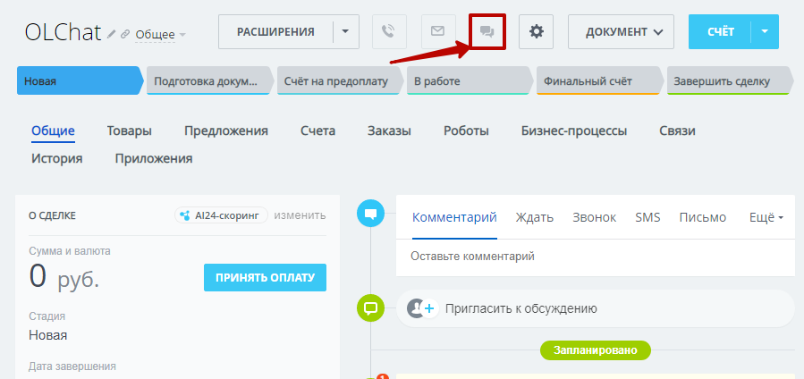
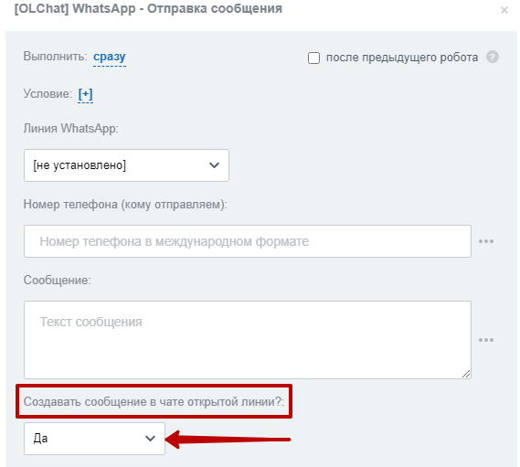

# Почему не создался чат открытой линии?

Причин, почему не создался или не активен чат открытой линии в лиде или сделке может быть несколько.

### Отключено создание сообщений в чате открытой линии

При отправке сообщения из карточки с помощью приложения OLChat, убедитесь, что опция **«Публиковать в чате»** активна.

<figure><figcaption></figcaption></figure>

Если отправка производится с помощью действия бизнес-процесса или робота, в настройках действия или робота проверьте параметр **«Создавать сообщение в чате открытой линии».** Он также должен быть активен.

<figure><figcaption></figcaption></figure>

### Отключено автосоздание лидов в настройках открытой линии

Зайдите в настройки открытой линии и убедитесь, что выбран параметр **«Автоматически создать новый лид».**

<figure><figcaption></figcaption></figure>


Подробнее о настройке открытой линии вы можете узнать в статье [nastroika-otkrytoi-linii.md](../../ustanovka-i-nastroika/nastroika-otkrytoi-linii.md "mention")


### Отключено создание чатов и публикация в них сообщений в настройках чата в приложении

Зайдите в приложение **OLChat — Коннектор — Настройки чата.** Убедитесь, что все галочки как показано на скриншоте ниже активны.

<figure><figcaption></figcaption></figure>

### Чат открытой линии привязался к другой сущности

Чат открытой линии может не отображаться в карточке, т.к. привязался к другой сущности. Чтобы увидеть, к какой сущности привязался чат, зайдите в **Контакт-центр — Список диалогов.** В колонке «Запись в CRM» отображаются все связи данного диалога с CRM.

