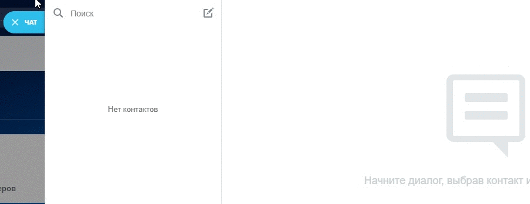

# OLChat — чат WhatsApp для открытых линий Битрикс24

### Вы нашли то, что давно искали. Приложение с быстрым подключением, отзывчивой техподдержкой и мощным функционалом! С помощью OLCha&#x74;**:**&#x20;

✅ Подключайте WhatsApp к Битрикс24 и больше не переживайте о постоянном подключении телефона. Зарядка и Wi-fi не важны!

✅ Пишите клиентам первыми из карточки CRM&#x20;

✅ Подключайте групповые чаты WhatsApp&#x20;

✅ Добавляйте виджет на сайт

✅ Автоматизируйте отправку сообщений с помощью роботов и бизнес-процессов&#x20;

✅ Используйте рандомизатор для рассылки сообщений&#x20;

✅ Получайте статусы отправки сообщений&#x20;

✅ Используйте в сообщениях любые виды медиа&#x20;

✅ Подключайте бота-помощника, который управляет заголовком чата, добавляет аватарку клиента к контакту, записывает параметры аналитики.&#x20;

### Ещё возможности:&#x20;

▶ Писать из мобильного приложения Битрикс24&#x20;

▶ Для всех голосовых сообщений и пропущенных звонков настраивать автоответчик&#x20;

▶ При пропущенных звонках автоматически создаётся дело на сущности CRM&#x20;

▶ Передача параметров аналитики&#x20;

▶ Шорткоды&#x20;

▶ Использование умных сценариев

### Преимущества:

👍 Не нужно постоянное подключение телефона. Зарядка и Wi-fi не важны!

👍 Нет ограничений на количество сообщений и диалогов, операторов, переподключений номеров.&#x20;

👍 Много роботов и активити бизнес-процессов. На нашем приложении можно строить почти любую логику автоматизации.&#x20;

👍 Подробная документация по настройкам и функционалу.&#x20;

👍 Отзывчивая техподдержка, которая всегда на связи.&#x20;

👍 OLChat работает стабильно и не тормозит.&#x20;

👍 Наш функционал постоянно развивается на основе запросов и обратной связи от клиентов и партнёров.&#x20;

👍 Мы круто интегрируемся в открытые линии, учитываем многие особенности Битрикс24.&#x20;

👍 Совсем недавно мы ещё больше прокачали функционал интеграции с группами WhatsApp.

**Есть вопросы? Напишите нам.**

Чат поддержки: [Bitrix24.Network](https://auth2.bitrix24.net/oauth/select/?preset=im\&IM_DIALOG=networkLines7c380c91ab28dacab02d3af93fecdbf9) / [Telegram](http://t.me/olchat_support_bot)

### Как открыть чат поддержки из Битрикс24?

[Лицензионное соглашение](https://olchat.io/eula-ru)

[Условия о конфиденциальности](https://olchat.io/privacy-ru)
