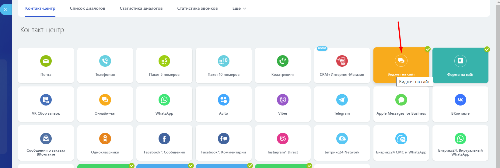

# Виджет для сайта

Для добавления виджета WhatsApp на ваш сайт в левом меню портала войдите в приложение **OLChat — значок «•••» (меню вызова настроек коннектора) — Виджет на сайт.**\
\
Укажите текст приветствия и название виджета в соответствующих полях. Нажмите на кнопку «Сохранить».

Также вы можете скопировать ссылку на чат в WhatsApp, нажав на иконку «Скопировать ссылку» в разделе «Ссылка на чат в WhatsApp»:

<figure><figcaption></figcaption></figure>


Если вы настраиваете передачу параметров аналитики, то в тексте приветствия не должно быть переносов сроки. В ином случае [бот-помощник](https://docs.olchat.io/bot-pomoshnik) не сможет распознать параметр аналитики и записать в поле CRM.&#x20;

При передаче параметров аналитики, бот не ищет цифры по всем тексту - бот вытягивает цифры, которые подставились в {visit id} и записывает в поле. Лучше, чтобы {visit id} находился в конце текста.&#x20;



Обратите внимание, что текст указываемый в поле «Текст приветствия» это тот текст, который появляется в поле набора сообщения у клиента после того как он нажмёт на кнопку виджета на сайте.

Также, это поле можно оставлять пустым. Но для анализа маркетинговых каналов рекомендуем написать какой-то текст, с помощью которого вы в последствии сможете идентифицировать канал.


<figure><figcaption></figcaption></figure>

Далее перейдите в **Контакт-центр — Виджет на сайт**.

<figure><figcaption></figcaption></figure>

Включите канал в настройках виджета:

.png>)

.png>)

Если у вас уже существует и настроена линия с каким-то набором подключенным каналов, вы можете подключить к ней канал из другой линии. Это может пригодиться в случае, если для приложения OLChat вы использовали отдельную открытую линию со своим сценарием обработки и распределения входящих сообщений от клиентов.

Для добавления канала WhatsApp из открытой линии подключенной к приложению OLChat, в настройках виджета нажмите ссылку «добавить открытую линию».

.png>)

Выберите нужную открытую линию. Включите канал в настройках виджета.

.png>)


После установки виджет может появиться на сайте не сразу, т.к. он кэшируется на стороне Битрикс24. Чаще всего такое случается на коробочных версиях Битрикс24. Обновляться виджет может в течение 15-60 минут.

Для ускорения обновления данных в виджете рекомендуем выключать и включать виджет. Тогда кэш виджета обновляется быстрее и применяются новые настройки.


Для выключения и включения виджета перейдите в раздел **CRM – Интеграции – Виджет на сайт**.

<figure><figcaption></figcaption></figure>

С помощью кнопки Код на сайт вы можете скопировать код виджета, а кнопка Выключить позволяет управлять активностью виджета. Например, если вы хотите временно скрыть виджет от посетителей сайта, можете его отключить.&#x20;

Чтобы включить виджет, найдите нужный виджет и напротив него нажмите на кнопку «ВЫКЛЮЧИТЬ» а затем «ВКЛЮЧИТЬ».

<figure><figcaption></figcaption></figure>

<figure><figcaption></figcaption></figure>

### Как установить виджет на сайт 

Вы можете установить виджет на любой сайт: как созданный в Битрикс24, так и на другой CMS.

Если вы хотите установить виджет на сайт, созданный в Битрикс24, то в настройках сайта выберите нужный виджет.

<figure><figcaption></figcaption></figure>

Чтобы установить виджет на любой другой сайт, необходимо скопировать код виджета и поместить его в код шаблона вашего сайта перед закрывающим тегом **`/body`**. Код вы можете скопировать из настроек виджета.


Для корректной работы виджета в коробочной версии Битрикс24, установите актуальные обновления Главного модуля.



С другими настройками виджета для сайта в Битрикс24 можете ознакомиться здесь:\
[https://helpdesk.bitrix24.ru/open/6986667/](https://helpdesk.bitrix24.ru/open/6986667/)


## Если один номер телефона подключаем в виджеты на два сайта, то как отследить с какого сайта пишет клиент?

Для реализации данного сценария можно подставить в текст ссылки какой-либо идентификатор для каждого сайта.&#x20;

Подробнее ознакомиться можно [здесь](https://faq.whatsapp.com/5913398998672934/?locale=ru_RU).
