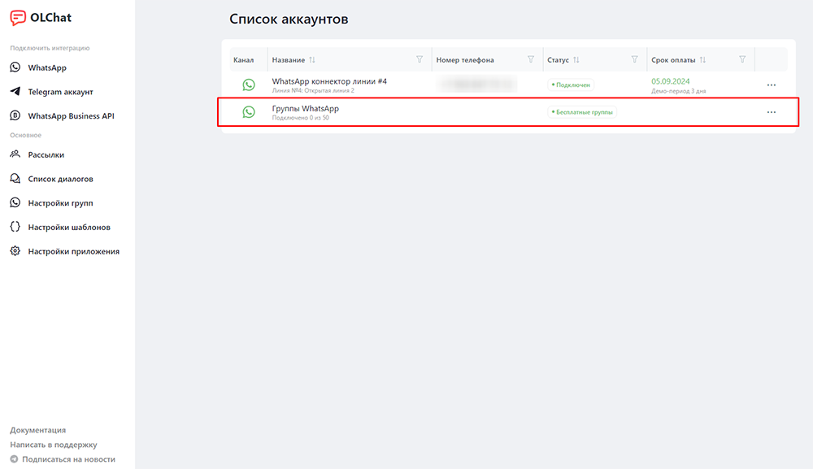
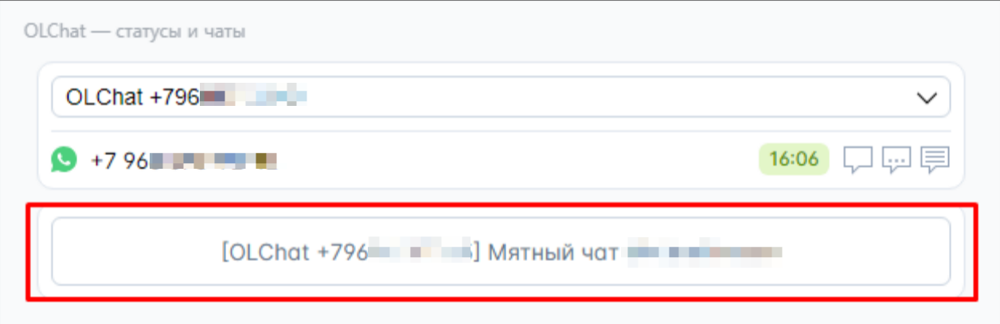

# Групповые чаты

Мы интегрировали групповые чаты WhatsApp в Битрикс24. Все групповые чаты отображаются в Чатах, а не в Открытых линиях.


Сейчас доступно 50 бесплатных групповых чатов. Групповые чаты работают только при активном коннекторе (аккаунте WhatsApp).

Подключение свыше 50 групповых чатов [оплачивается отдельно](https://docs.olchat.io/stoimost-i-oplata-prilozheniya#stoimost-podklyucheniya-grupp-whatsapp).



В настоящее время поддерживается работа в группах до 500 участников. Работа с группами свыше 500 участников может быть не стабильной.
\
Техотдел работает над оптимизацией нагрузки и обеспечением корректной работы групп свыше 500 участников.



Внимание! Если вы только недавно зарегистрировали номер в WhatsApp (создали аккаунт в WhatsApp) и подключили его к нашему сервису, в течение нескольких дней не создавайте группы с помощью сервиса! Если необходимо создать группу – сделайте это через приложение WhatsApp на телефоне, а потом подключите её к сервису.

Игнорирование данной рекомендации может привести к блокировке вашего аккаунта WhatsApp!


<figure><figcaption></figcaption></figure>

### Подключение групп

Чтобы подключить группы WhatsApp, в левом меню на портале зайдите в приложение OLCha&#x74;**.** Затем перейдите в «Настройки групп» в меню приложения или в списке аккаунтов напротив «Группы WhatsApp» нажмите на **«•••»** – значок вызова настроек подключенных групп:

<figure><figcaption></figcaption></figure>

В открывшемся окне нажмите на кнопку **«ДЕЙСТВИЯ» — «ПОДКЛЮЧИТЬ ГРУППУ»**, выберите активный коннектор, затем группу, которую хотите подключить и нажмите на кнопку «ПОДКЛЮЧИТЬ ГРУППУ». Группа подключена и вы можете перейти в создавшийся чат.

<figure><figcaption></figcaption></figure>

<figure><figcaption></figcaption></figure>


Список групп для удобства отображения отсортирован в алфавитном порядке. Также доступен поиск по группам.


### Создание групп

Кроме подключения групп в которых вы состоите, можно создавать новые группы и добавлять в них участников. Для этого нажмите на кнопку **«ДЕЙСТВИЯ» — «НОВАЯ ГРУППА WA».**

<figure><figcaption></figcaption></figure>

Внесите данные создаваемой группы:

<figure><figcaption></figcaption></figure>

1. Выберите коннектор
2. Введите название группы
3. Укажите список телефонов участников группы
4. Группу можно подключить в Битрикс24 сразу после её создания. Для этого необходимо сделать галочку активной
5. Скрывать имена сотрудников. Активная галочка указывает на то, что в группу не будут публиковаться имена сотрудников из их профиля на портале Битрикс24 когда они отправляют сообщения в группу
6. Скрывать номера пользователей в группе. Настройка управляет возможностью скрывать\показывать номера клиентов в групповых чатах в Битрикс24. Если данная настройка включена, сотрудники портала, добавленные в групповой чат в Битрикс24 не будут видеть номер клиента целиком, т.к. часть номера будет заменена символами **\***\
   .png>)

После внесения информации нажмите на кнопку «СОЗДАТЬ ГРУППУ».

### Описание настроек групп

В настройках групп вы можете ознакомиться со списком подключенных групп. Чтобы перейти в настройки конкретной группы, нажмите на значок ➕ напротив группы. Развернётся меню с дополнительными настройками для данной группы.

<figure><figcaption></figcaption></figure>

<figure><figcaption></figcaption></figure>

1. Чат группы — название подключенной группы. При клике на название группы открывается чат данной группы. Также вы можете изменить название группы, нажав на кнопку «ПЕРЕИМЕНОВАТЬ».
2. Аватар группы. Отображается картинка, установленная в качестве аватара в группе. При необходимости можно сменить, нажав на кнопку «СМЕНИТЬ АВАТАР».
3. Сотрудники в чате — выводит список сотрудников портала, присутствующих в чате группы. Чтобы добавить сотрудников в чат группы, необходимо нажать на кнопку «ДОБАВИТЬ СОТРУДНИКОВ» и выбрать его из структуры компании. Чтобы удалить сотрудника из чата, нажмите на значок «✖» крестик напротив ФИО сотрудника.
4. Статус — показывает текущий статус соединения. Чтобы отключить группу нажмите на кнопку «ОТКЛЮЧИТЬ ГРУППУ».
5. ID группы — закодированное название подключенной группы.&#x20;
6. Скрывать имена сотрудников. Активная галочка указывает на то, что в группу не будут публиковаться имена сотрудников из их профиля на портале Битрикс24 когда они отправляют сообщения в группу
7. Скрывать номера пользователей в группе. Настройка управляет возможностью скрывать\показывать номера клиентов в групповых чатах в Битрикс24. Если данная настройка включена, сотрудники портала, добавленные в групповой чат в Битрикс24 не будут видеть номер клиента целиком, т.к. часть номера будет заменена символами **\***
8. Пытаться получать имена из CRM. В группе WhatsApp не всегда есть контакты и имена. При включении этой опции производится попытка получить имена из базы CRM.
9. Пригласительная ссылка. Данную ссылку вы можете скопировать, нажав на неё, и отправить пользователю WhatsApp, которого хотите пригласить в группу.
10. Список пользователей. Отображает список номеров пользователей, состоящих в группе в данный момент. Чтобы добавить пользователя в группу нажмите на кнопку «ДОБАВИТЬ НОМЕР». Чтобы удалить пользователя из группы, нажмите на значок «✖» крестик напротив номера телефона пользователя.
11. Связь с CRM. К сущности CRM можно прикрепить ссылку на групповой чат. Она появится в виджете [vidzhet-statusy-i-chaty.md](../ispolzovanie/vidzhety-v-kartochke-crm/vidzhet-statusy-i-chaty.md "mention") в карточке CRM.

<figure><figcaption></figcaption></figure>


Ссылка есть в группе, если подключенный номер является владельцем группы или администратором. \
\
Иногда ссылки может не быть, если создатель группы вышел из чата и не назначил новых администраторов. В таком случае лучше всего создать новую группу и пригласить туда участников, если необходима ссылка.  Также можно попробовать пересоздать ссылку приглашения из телефона.



Перед добавлением в группу пользователей по номеру телефона, рекомендуем ознакомиться со статьёй [osobennosti-dobavleniya-polzovatelei-v-gruppy.md](osobennosti-dobavleniya-polzovatelei-v-gruppy.md "mention")

