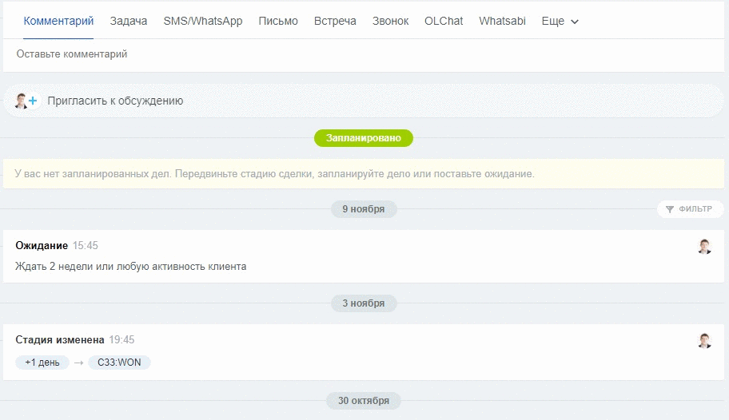

# Отправка сообщений через функционал SMS

Для отправки сообщения из карточки Лида, Сделки, Контакта, Компании, рассылок через CRM-маркетинг или для отправки ссылок на оплату в Центре продаж можно воспользоваться функционалом отправки SMS.


Наш сервис не отправляет SMS-сообщения! Он позволяет отправить сообщение в Whatsapp через функционал SMS. Для отправки именно SMS-сообщений, на вашем портале Битрикс24 должен быть подключён провайдер SMS.



Мы не рекомендуем отправлять сообщения через функционал SMS. Эта возможность не предназначена для переписки. Используйте этот функционал только там, где без него не обойтись. Например, для отправки рассылок через CRM-маркетинг или для отправки ссылок на оплату в Центре продаж.

Во всех других случаях используйте функционал [чатов открытых линий](./), наше [приложение](kak-napisat-pervym-cherez-prilozhenie-olchat-v-kartochke.md), [виджет](../vidzhety-v-kartochke-crm/), [роботов](../../roboty-i-aktiviti/roboty/).



Если вам необходимо отключить SMS-провайдера на линии, то необходимо написать нам в поддержку, чтобы мы его отключили.&#x20;


### Отправка через веб-версию Битрикс24

Нажмите на «Подробнее» чтобы выбрать нужный коннектор

.png>)

.png>)

Напишите сообщение и нажмите «Отправить»

.png>)

### Отправка через мобильное приложение Битрикс24

Также вы можете отправить сообщение с помощью функционала SMS через мобильное приложение Битрикс24. Подробнее об этом [здесь](https://docs.olchat.io/ispolzovanie/poluchenie-i-otpravka-soobshenii/otpravka-soobshenii-iz-mobilnogo-prilozheniya-bitriks24#otpravka-cherez-funkcional-sms).

### Включение провайдера SMS и особенности метода


У отправки через SMS есть следующие особенности и недостатки:

1. Этим способом можно отправлять **только текст** длиной до 200 символов. Нельзя использовать 99% эмодзи.
2. В интерфейсе Б24 сервис, через который производится отправка по умолчанию скрыт. Если у вас подключено несколько каналов (номеров), можно легко запутаться и отправить сообщение не с того номера. Для уточнения и выбора  сервиса отправки необходимо нажимать на «Подробнее».
3. Не создаётся дело со статусами отправки, доставки и прочтения сообщения.


Вы можете столкнуться с ситуацией, когда провайдер WhatsApp не появляется в выборе сервисов отправки

.png>)


При возникновении такой ситуации, перейдите в приложение OLChat и убедитесь, что линия оплачена, QR-код отсканирован, телефон подключен. Также проверьте, что в настройках коннектора в разделе «Чаты» активирован чекбокс в пункте «Включить провайдера СМС».


<figure><figcaption></figcaption></figure>
