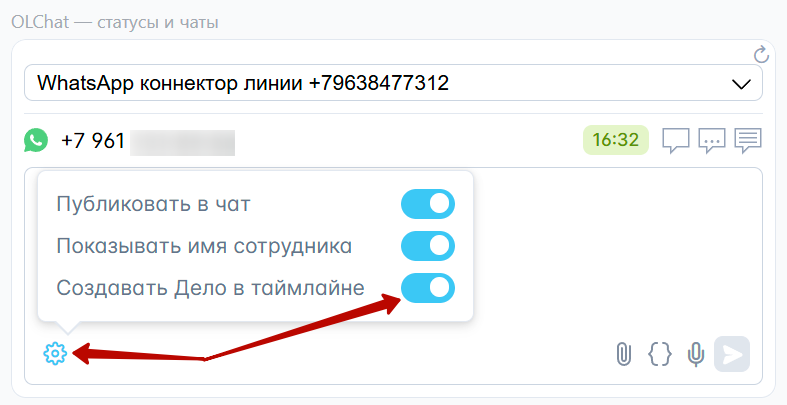

# OLChat — статусы и чаты

Виджет «OLChat — статусы и чаты» информирует о том, на каких номерах клиента установлен WhatsApp, показывает, в каком регионе зарегистрирован номер клиента, предоставляет информацию об операторе и времени клиента. Также виджет обеспечивает быстрый доступ из карточки любой сущности CRM к выбору линии, созданию нового чата, переходу в уже созданный чат, к истории чата, позволяет отправить сообщение клиенту прямо из карточки CRM не переходя в основное приложение.

<figure><figcaption></figcaption></figure>


По умолчанию виджет «Статусы и чаты» при заходе в карточку сущности отображаются в скрытом виде с кнопкой «Написать в WhatsApp».

Сделано это для снижения рисков блокировки номера, т.к. при каждом заходе в карточку, виджетом производится проверка номеров указанных в карточке на наличие аккаунта WhatsApp. При этом, если вы не производите отправку сообщений посредством приложения, возрастает соотношение количества проверок номеров к количеству отправок, что может повлечь за собой блокировку вашего аккаунта WhatsApp.


<figure><figcaption></figcaption></figure>


Подробнее о том, как включить и показать виджет в карточке ознакомьтесь в статье [#kak-vklyuchit-i-vyklyuchit-vidzhety](./#kak-vklyuchit-i-vyklyuchit-vidzhety "mention")

Если вы хотите включить виджет «Статусы и чаты» для постоянного отображения, ознакомьтесь с разделом статьи [#vozmozhnosti](../../ustanovka-i-nastroika/interfeisy-prilozheniya/opisanie-nastroek-prilozheniya.md#vozmozhnosti "mention")


### Выбор линии и номера телефона клиента

Если вы подключили несколько коннекторов линий, то вы можете выбрать, с какой именно линии начать диалог с клиентом:

<figure><figcaption></figcaption></figure>

Если к сущности CRM прикреплено несколько контактов или компаний, в виджет подтянутся телефоны на которых установлен WhatsApp из всех прикреплённых контактов и компаний (до 10 телефонов).

<figure><figcaption></figcaption></figure>

### Создание нового диалога и переход в уже созданный чат

Чтобы начать новый диалог с клиентом, выберите нужный номер телефона, на который хотите написать и нажмите на иконку «Создать чат»

<figure><figcaption></figcaption></figure>

Если диалог с клиентом уже начат и чат был создан до этого, вы будете видеть иконку «Открыть чат». После нажатия на неё вы перейдёте в текущий чат с клиентом

<figure><figcaption></figcaption></figure>


Через виджет вы можете открыть чат находясь в любой сущности CRM, даже если он не привязан к текущей сущности


### Отправка сообщений, файлов и голосовых из виджета

Виджет позволяет отправить сообщение клиенту прямо из карточки CRM не переходя в основное приложение. Для этого необходимо нажать на иконку «Написать в чат». В открывшемся поле введите текст сообщения и нажмите на кнопку отправки сообщения.

<figure><figcaption></figcaption></figure>

Кроме обычного текстового сообщения, с помощью виджета также можно:

* Отправить файл

<figure><figcaption></figcaption></figure>

* Отправить шаблонное сообщение

<figure><figcaption></figcaption></figure>


Список шаблонов по умолчанию отсортирован в алфавитном порядке по возрастанию (А-Я).&#x20;

Первыми из выпадающего списка являются 5 недавно использовавшихся шаблонов.


* Записать голосовое сообщение

<figure><figcaption></figcaption></figure>

### Публиковать в чат

<figure><figcaption></figcaption></figure>

Также из виджета вы можете управлять тем, будет ли сообщение, отправленное через виджет, опубликовано в чате открытой линии. Если чек-бокс «Публиковать в чат» активирован, то сообщение не только зафиксируется в таймлайне карточки, но и появится в чате открытой линии.

### Показывать имя сотрудника

<figure><figcaption></figcaption></figure>

Настройка позволяет скрывать или отображать имя сотрудника, от которого было отправлено сообщение. По умолчанию данная функция выключена. Если чек-бокс «Показывать имя сотрудника» активирован, то в сообщение, отправленное через виджет, добавится заголовок с именем сотрудника. Данная настройка применяется индивидуально на каждого пользователя.

<figure><figcaption></figcaption></figure>

### Создавать Дело в таймлайне

<figure><figcaption></figcaption></figure>

Если чек-бокс «Создавать Дело в таймлайне» активирован, то в таймлайне карточки после отправки сообщения создастся дело с информацией и содержанием сообщения:

<figure><figcaption></figcaption></figure>

### История чата с клиентом

При клике на иконку «Открыть историю чата» открывается вся доступная для веб-версии WhatsApp переписка, даже если раньше у вас не была подключена интеграция WhatsApp с Битрикс24 или подключена другая интеграция (приложение):

<figure><figcaption></figcaption></figure>

<figure><figcaption></figcaption></figure>

### Обновление информации в виджете


Обратите внимание, информация в виджете обновляется не чаще, чем 1 раз в 10 минут.


### Что делать, если виджет не работает?

Необходимо проверить [#prava-na-prilozhenie](../../ustanovka-i-nastroika/nastroika-prav-dlya-raboty-s-prilozheniem-olchat.md#prava-na-prilozhenie "mention")

### Что делать при ошибке "Нет данных авторизации от Битрикс24"?&#x20;

<figure><figcaption></figcaption></figure>

В данном случае возможны следующие причины:\
1\. У сотрудника нет прав на приложение и поэтому виджет не видит авторизацию. Необходимо проверить [#prava-na-prilozhenie](../../ustanovka-i-nastroika/nastroika-prav-dlya-raboty-s-prilozheniem-olchat.md#prava-na-prilozhenie "mention")\
2\. Есть проблемы с сервером авторизации Битрикс24. Нужно ждать решение от Битрикс24.&#x20;
