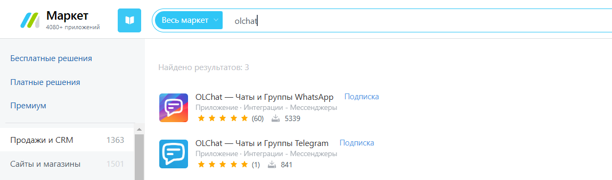

# Установка приложения

Установка приложения осуществляется через **Битрикс24 Маркетплейс**

Для установки приложения перейдите в «Маркет» вашего Битрикс24, введите в поиске «OLChat» и найдите приложение «OLChat — Чаты и Группы WhatsApp».

<figure><figcaption></figcaption></figure>

Выполните установку приложения, нажав на кнопку «УСТАНОВИТЬ»

<figure><figcaption></figcaption></figure>


Также вы можете установить приложение перейдя по ссылке на Маркет:&#x20;

[https://www.bitrix24.ru/apps/app/infocom.olchat/?p=132277](https://www.bitrix24.ru/apps/app/infocom.olchat/?p=132277)


После установки приложение OLChat появится в меню слева.

